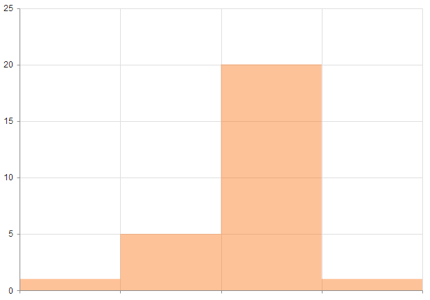
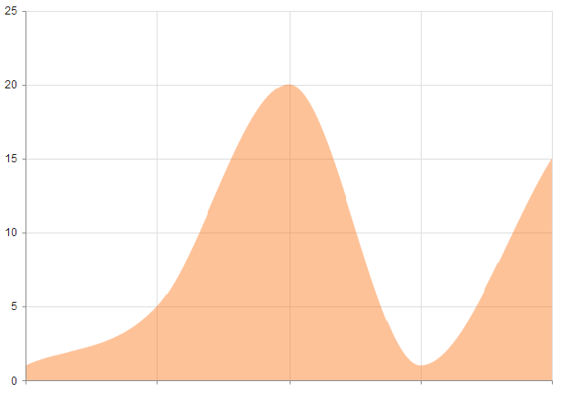

## Area Charts

Use "area" and "verticalArea" to define area charts.

Axes are configured through "categoryAxis" and "valueAxis". Multiple value axes are supported.

    $("#chart").kendoChart({
        title: {
            text: "Internet Users"
        },
        legend: {
            position: "bottom"
        },
        seriesDefaults: {
            type: "area"
        },
        series: [{
            name: "World",
            data: [15.7, 16.7, 20, 23.5, 26.6]
        }, {
            name: "United States",
            data: [67.96, 68.93, 75, 74, 78]
        }],
        valueAxis: {
            labels: {
                format: "{0}%"
            }
        },
        categoryAxis: {
            categories: [2005, 2006, 2007, 2008, 2009]
        }
    });

This configuration produces the following area chart:

## Line Style

The area chart supports rendering the lines between the points with different styles. The supported styles are "normal", "step" and "smooth" and can be set with the [line.style](/api/dataviz/chart#configuration-series.line.style) option. The default style is "normal" and will produce a straight line between the data points. When the style is set to "step", the data points will be connected only with vertical and horizontal lines. This style can be used to indicate that the value is constant between the changes. 
 

When the style is set to "smooth", the chart will display a fitted curve through the data points. The "smooth" style can be used if the data requires to be displayed with a curve or you just wish to connect the points with smooth instead of straight lines. 

