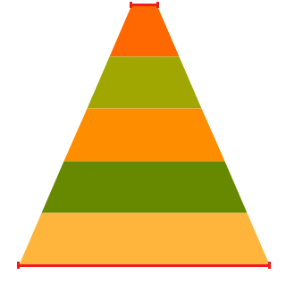
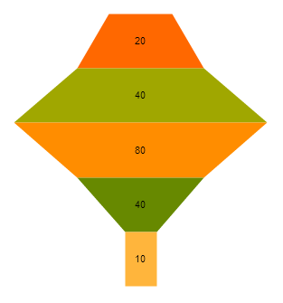

## Funnel Chart

The Funnel Chart represents its data in trapezoid area splitted into several segments.

Each segment represents the different values for each of the items of the series. The value of the dataItem can control both the height and/or the form of the different segments.

### When to use a Funnel Chart
Funnel charts are a type of chart, often used to represent stages in a sales process and show the amount of potential revenue for each stage. This type of chart can also be useful in identifying potential problem areas in an organization’s sales processes. A funnel chart is similar to a stacked percent bar chart. The Funnel charts are well suited for displaying several values.

### Understanding dynamicHeight, dynamicSlope and neckRatio

Dynamic Height specifies wheather the different elements should have equal height (when dynamicHeight is equal to false) or the height of each element should be based on its value.

If dynamicSlope is disabled then the neckRatio option is taken into account which specifies the ratio between the top and the bottom bases of the whole funnel series.
For example if neckRatio is set to ten then the top base will be ten times smaller than the bottom base.
The following example shows a funnel chart with neckRatio set to 10.

When dynamicSlope is enabled then the neckRatio is neglected and each segment creates its form based on the ratio between the current value and the next value.

You can see how the widths of the bases for each segment are based on the ratio currentValue/nextValue in the next example.

    

    

