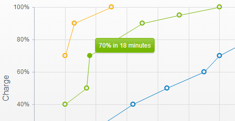

# Tooltip

The Chart can display details about the data point that the mouse is currently hovering. The border of this tooltip matches the color of the series.

## Configuration

The tooltip is not visible by default. You can enable it by setting the visible property of the tooltip object to true:

    $("#chart").kendoChart({
        series: [{
            type: "bar",
            name: "United States",
            data: [67.96, 68.93, 75, 74, 78]
        }],
        categoryAxis: {
            categories: [2005, 2006, 2007, 2008, 2009]
        },
        tooltip: {
            visible: true
        }
    });

The tooltip can also be configured per-series:

    series: [{
        type: "bar",
        name: "United States",
        data: [67.96, 68.93, 75, 74, 78],
        tooltip: {
          visible: true
        }
    }]

## Formating values

The point value can be formatted using the format property:

    tooltip: {
        visible: true,
        format: "Value: {0:N0}"
    }

The format string supports a subset of the syntax available in Java and C#.

Here "N0" indicates that the value should be rounded to a whole number and should have a thousands separator.

**Note: **Points in XY charts have two values - {0} and {1} (X and Y).

## Templates

Tooltip content can be defined with a Kendo Template when more flexibility is desired. The template provides access to all information associated with the point:

*   value - the point value. Value dimensions are available as properties, for example, **value.x** and **value.y**
*   category - the category name.
*   series - the data series.
*   dataItem - the original data item (when binding to dataSource).

For example:

    $("#chart").kendoChart({
         title: {
             text: "My Chart Title"
         },
         series: [{
             name: "Series 1",
             data: [200, 450, 300, 125]
         }],
         categoryAxis: {
             categories: [2000, 2001, 2002, 2003]
         },
         tooltip: {
             visible: true,
             template: "${category} - ${value}"
         }
    });

 
