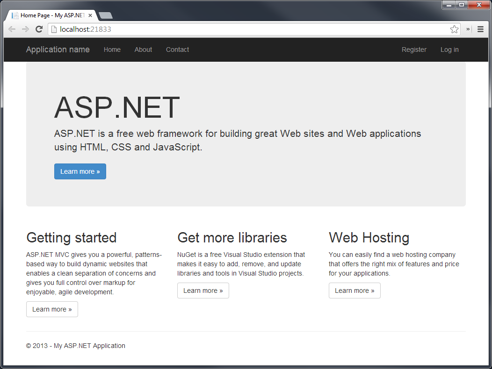
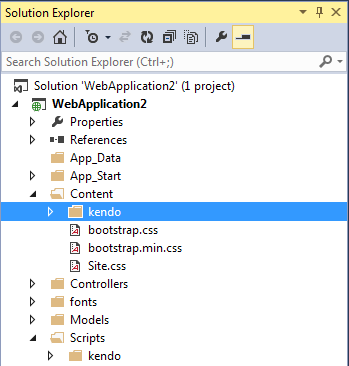
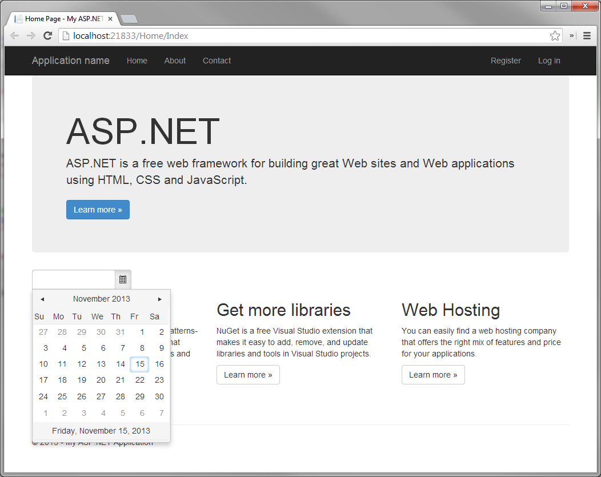

# Kendo UI in ASP.NET MVC 5 applications
This tutorial shows how to use Telerik UI for ASP.NET MVC in ASP.NET MVC 5 applications. The tutorial uses Visual Studio 2013 but will work with all Visual Studio versions that support ASP.NET MVC 5. The tutorial also creates a new ASP.NET MVC 5 application but the steps to use Kendo UI in exsiting ASP.NET MVC 5 application are the same.

**The Kendo UI Visual Studio extensions automate the whole procedure which this document describes.**
## Create a new ASP.NET MVC 5 Application

To create a new ASP.NET MVC 5 Application follow these steps.

1. Open **Visual Studio 2013**.
2. Press **CTRL+SHIFT+N** to create a new project.
3. Select the **Visual C#** node and then **Web** to show all available web project templates for C#.
4. Select **ASP.NET Web Application** and click **OK**. This will start the **New ASP.NET  Project** wizard.
5. Select **MVC** from the available templates and click **OK**.
6. Press **CTRL+F5** to build and run the application.

## Add Telerik UI for ASP.NET MVC to the application

To use Telerik UI for ASP.NET MVC you need to include the required JavaScript and CSS files, reference the Kendo.Mvc.dll assembly and update the web.config file of the application.

### Include the JavaScript and CSS files

Kendo UI requires certain JavaScript and CSS files to be included in the page. There are two options - either to include a local copy of those files **or** to use Kendo UI CDN (Content Delivery Network).

#### Using local JavaScript and CSS

To copy the Kendo UI JavaScript and CSS files in the Visual Studio Solution of the application follow these steps.

1. Navigate to the install location of Telerik UI for ASP.NET MVC**. By default it is in **C:\Program Files (x86)\Telerik\.
2. Copy the **js** directory from the install location and paste it in the **Script** folder of the application.
3. Copy the **styles** directory from the install location and paste it in the **Content** folder of the application.
4. Rename the **Scripts/js** directory to **Scripts/kendo**. Rename **Content/styles** to **Content/kendo**.

After the Kendo UI JavaScript and CSS files are added in the application you can include them.

1. Open **App_Start/BundleConfig.cs** to add bundles for Kendo UI.
2. Add a script bundle for Kendo UI.

        bundles.Add(new ScriptBundle("~/bundles/kendo").Include(
                    "~/Scripts/kendo/kendo.all.min.js",
                    // "~/Scripts/kendo/kendo.timezones.min.js", // uncomment if using the Scheduler
                    "~/Scripts/kendo/kendo.aspnetmvc.min.js"));

3. Add a style bundle for Kendo UI.

        bundles.Add(new StyleBundle("~/Content/kendo/css").Include(
                    "~/Content/kendo/kendo.common-bootstrap.min.css",
                    "~/Content/kendo/kendo.bootstrap.min.css"));

4. Tell ASP.NET bundles to allow minified files in debug mode.

        bundles.IgnoreList.Clear();

5. Open the layout of the application. By default it is **Views/Shared/_Layout.cshtml** (or **Site.master** if using **ASPX**).
6. Render the Kendo UI style bundle.

    - Razor

            @Styles.Render("~/Content/kendo/css")

    - ASPX

            <%: Styles.Render("~/Content/kendo/css") %>

7. Move the jQuery bundle to the **head** tag of the page. It is at the end of the page by default.
8. Render the Kendo UI script bundle **after** jQuery.

    - Razor

            @Scripts.Render("~/bundles/jquery")
            @Scripts.Render("~/bundles/kendo")

    - ASPX

            <%: Scripts.Render("~/bundles/jquery") %>
            <%: Scripts.Render("~/bundles/kendo") %>

#### Using Kendo UI CDN

To include the Kendo UI JavaScript and CSS files from CDN follow these steps. Important! Don't forget to replace "kendo ui version" from the code snippets below with the current version of Kendo UI e.g. "2013.2.918".

1. Open the layout of the application. By default it is **Views/Shared/_Layout.cshtml** (or **Site.master** if using ASPX).
2. Include **kendo.common-bootstrap.min.css** and **kendo.bootstrap.min.css**. Add a **link** tag within the **head** tag of the layout.

        <link rel="stylesheet" href="http://cdn.kendostatic.com/<kendo ui version>/styles/kendo.common-bootstrap.min.css" />
        <link rel="stylesheet" href="http://cdn.kendostatic.com/<kendo ui version>/styles/kendo.bootstrap.min.css" />

3. Move the jQuery bundle to the **head** tag of the page. It is at the end of the page by default.
4. Include **kendo.all.min.js** and **kendo.aspnetmvc.min.js** _after_ jQuery.

        
        

5. If using Kendo UI Scheduler include **kendo.timezones.min.js** _after_ **kendo.all.min.js**

        
        
        

### Add reference to Kendo.Mvc.dll

The next step is to add a reference to **Kendo.Mvc.dll** which is the assembly containing the Kendo UI server-side wrappers.

1. Right-click the **References** node in Solution Explorer and click **Add Reference**.
2. Select the **Browse** tab of the **Add Reference** dialog and navigate to the install location of Telerik UI for ASP.NET MVC.
3. Navigate to **wrappers/aspnetmvc/Binaries/MVC5**. This directory contains the ASP.NET MVC 5 version of Telerik UI for ASP.NET MVC.
4. Select **Kendo.Mvc.dll** and click **OK**.

### Update the web.config

The next step is to let ASP.NET MVC know of the Kendo.Mvc.UI namespace where the server-side wrappers are. To do this update the web.config file of the web application.

1. Open **Views/Web.config** (or root **Web.config** if using **ASPX**).
2. Locate the **namespaces** tag.
3. Append an **add** tag to the **namespaces** tag.

        <namespaces>
            <add namespace="System.Web.Mvc" />
            <add namespace="System.Web.Mvc.Ajax" />
            <add namespace="System.Web.Mvc.Html" />
            <add namespace="System.Web.Routing" />
            <add namespace="Kendo.Mvc.UI" />
        </namespaces>

## Use a Kendo UI widget

Finally lets use a Kendo UI widget.

1. Open the **Views/Home/Index.cshtml** view (or **Index.aspx** if using **ASPX**).
2. Add a Kendo UI DatePicker widget.
    - Razor

            @(Html.Kendo().DatePicker().Name("datepicker"))
    - ASPX

            <%: Html.Kendo().DatePicker().Name("datepicker") %>

3. Press **CTRL+F5** to build and run the application.

## Next steps

* [Fundamentals](/kendo-ui/getting-started/using-kendo-with/aspnet-mvc/fundamentals)
* [Using the Kendo UI Visual Studio Extensions](/kendo-ui/getting-started/using-kendo-with/aspnet-mvc/vs-integration/introduction)
* [Troubleshooting](/kendo-ui/getting-started/using-kendo-with/aspnet-mvc/troubleshooting)
