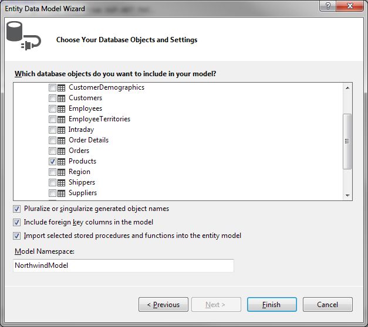
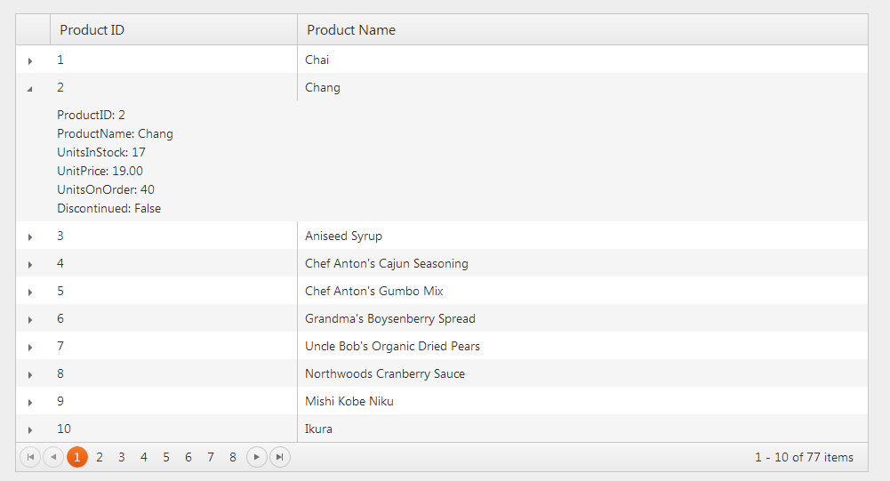
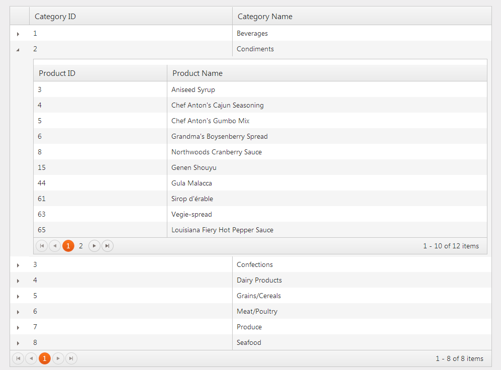

# Server Detail Template

## Introduction

Kendo UI Grid for ASP.NET MVC provides the ability to show additional info for a data item. This is done by setting the detail template of the grid
This help topic shows how to use detail template which is used in server binding scenarios.

## Server details

The following tutorial shows how to configure Kendo UI Grid for ASP.NET MVC to display additional details of the **Product** entity from the **Northwind** database.

1.  Create a new ASP.NET MVC 4 application (or Kendo UI ASP.NET MVC application if you have installed the [Kendo UI Visual Studio Extensions](/getting-started/using-kendo-with/aspnet-mvc/introduction#kendo-ui-for-asp.net-mvc-visual-studio-extensions)).
Name the application "KendoGridServerDetailTemplate". If you decided not to use the Kendo UI Visual Studio Extensions followe the steps from the [introduction](/getting-started/using-kendo-with/aspnet-mvc/introduction) help topic in order
to add Kendo UI Complete for ASP.NET MVC to the application.
1.  Add a new "Entity Framework Data Model". Right click the `~/Models` folder in the solution explorer and pick "Add ->  New Item". Choose "Data -> ADO.NET Entity Data Model" in the "Add New Item" dialog.
Name the model "Northwind.edmx" and click "Next". This will start the "Entity Data Model Wizard".

1.  Pick the "Generate from database" option and click "Next". Configure a connection to the Northwind database. Click "Next".

1.  Choose the "Products" table from the "Which database objects do you want to include in your model?". Leave all other options as they are set by default. Click "Finish".

1.  Open HomeController.cs and edit the "Index" action method.

        public ActionResult Index()
        {
            var northwind = new NorthwindEntities();
            ViewBag.Products = northwind.Products;
            return View();
        }
1. In the view configure the grid for server binding to `ViewBag.Products`
    - Index.aspx (ASPX)

            <% Html.Kendo().Grid((IEnumerable<KendoGridServerDetailTemplate.Models.Product>)ViewBag.Products)
                  .Name("grid")
                  .Columns(columns =>
                  {
                      columns.Bound(product => product.ProductID);
                      columns.Bound(product => product.ProductName);
                  })
                  .Render();
            %>
    - Index.cshtml (Razor)

            @(Html.Kendo().Grid((IEnumerable<KendoGridServerDetailTemplate.Models.Product>)ViewBag.Products)
                  .Name("grid")
                  .Columns(columns =>
                  {
                      columns.Bound(product => product.ProductID);
                      columns.Bound(product => product.ProductName);
                  })
            )
1. Set the detail template.
    - Index.aspx (ASPX)

            <%: Html.Kendo().Grid((IEnumerable<KendoGridServerDetailTemplate.Models.Product>)ViewBag.Products)
                  .Name("grid")
                  .Columns(columns =>
                  {
                      columns.Bound(product => product.ProductID);
                      columns.Bound(product => product.ProductName);
                  })
                  .Pageable()
                  .DetailTemplate(product => {
                  %>
                      
ProductID: <%: product.ProductID %>

                      
ProductName: <%: product.ProductName %>

                      
UnitsInStock: <%: product.UnitsInStock %>

                      
UnitPrice: <%: product.UnitPrice %>

                      
UnitsOnOrder: <%: product.UnitsOnOrder %>

                      
Discontinued: <%: product.Discontinued %>

                  <%
                  })
                  .Render();
            %>
    - Index.cshtml (Razor)

            @(Html.Kendo().Grid((IEnumerable<KendoGridServerDetailTemplate.Models.Product>)ViewBag.Products)
                  .Name("grid")
                  .Columns(columns =>
                  {
                      columns.Bound(product => product.ProductID);
                      columns.Bound(product => product.ProductName);
                  })
                  .Pageable()
                  .DetailTemplate(@<text>
                      
ProductID: @item.ProductID

                      
ProductName: @item.ProductName

                      
UnitsInStock: @item.UnitsInStock

                      
UnitPrice: @item.UnitPrice

                      
UnitsOnOrder: @item.UnitsOnOrder

                      
Discontinued: @item.Discontinued

                  </text>)
            )
1. Build and run.

## Server hierarchy

The following tutorial shows how to configure Kendo UI Grid for ASP.NET MVC to display all **Product** entities available per **Category** entity from the **Northwind** database.

1.  Create a new ASP.NET MVC 4 application (or Kendo UI ASP.NET MVC application if you have installed the [Kendo UI Visual Studio Extensions](/getting-started/using-kendo-with/aspnet-mvc/introduction#kendo-ui-for-asp.net-mvc-visual-studio-extensions)).
Name the application "KendoGridServerHierarchy". If you decided not to use the Kendo UI Visual Studio Extensions followe the steps from the [introduction](/getting-started/using-kendo-with/aspnet-mvc/introduction) help topic in order
to add Kendo UI Complete for ASP.NET MVC to the application.
1.  Add a new "Entity Framework Data Model". Right click the `~/Models` folder in the solution explorer and pick "Add ->  New Item". Choose "Data -> ADO.NET Entity Data Model" in the "Add New Item" dialog.
Name the model "Northwind.edmx" and click "Next". This will start the "Entity Data Model Wizard".

1.  Pick the "Generate from database" option and click "Next". Configure a connection to the Northwind database. Click "Next".

1.  Choose the "Products" and "Categories" tables from the "Which database objects do you want to include in your model?". Leave all other options as they are set by default. Click "Finish".
1.  Open HomeController.cs and edit the "Index" action method.

        public ActionResult Index()
        {
            var northwind = new NorthwindEntities();
            ViewBag.Products = northwind.Categories;
            return View();
        }
1. In the view configure the grid for server binding to `ViewBag.Categories`
    - Index.aspx (ASPX)

            <% Html.Kendo().Grid((IEnumerable<KendoGridServerHierarchy.Models.Category>)ViewBag.Categories)
                  .Name("grid")
                  .Columns(columns =>
                  {
                      columns.Bound(category => category.CategoryID);
                      columns.Bound(category => category.CategoryName);
                  })
                  .Render();
            %>
    - Index.cshtml (Razor)

            @(Html.Kendo().Grid((IEnumerable<KendoGridServerHierarchy.Models.Category>)ViewBag.Categories)
                  .Name("grid")
                  .Columns(columns =>
                  {
                      columns.Bound(category => category.CategoryID);
                      columns.Bound(category => category.CategoryName);
                  })
            )
1. Set the detail template. Define another grid which is bound to the `Products` property of the category entity. Make sure the name of the grid is unique.

    - Index.aspx (ASPX)

            <% Html.Kendo().Grid((IEnumerable<KendoGridServerHierarchy.Models.Category>)ViewBag.Categories)
                  .Name("grid")
                  .Columns(columns =>
                  {
                      columns.Bound(category => category.CategoryID);
                      columns.Bound(category => category.CategoryName);
                  })
                  .DetailTemplate(category => {
                  %>
                    <% Html.Kendo().Grid(item.Products)
                          .Name(string.Format("product_grid_{0}", item.CategoryID)) // the Name() should be unique
                          .Columns(columns =>
                          {
                              columns.Bound(product => product.ProductID);
                              columns.Bound(product => product.ProductName);
                          })
                          .Pageable()
                          .Render();
                    %>
                  <%
                  })
                  .Render();
            %>
    - Index.cshtml (Razor)

            @(Html.Kendo().Grid((IEnumerable<KendoGridServerHierarchy.Models.Category>)ViewBag.Categories)
                  .Name("grid")
                  .Columns(columns =>
                  {
                      columns.Bound(category => category.CategoryID);
                      columns.Bound(category => category.CategoryName);
                  })
                  .Pageable()
                  .DetailTemplate(@<text>
                    @(Html.Kendo().Grid(item.Products)
                          .Name(string.Format("product_grid_{0}", item.CategoryID)) // the Name() should be unique
                          .Columns(columns =>
                          {
                              columns.Bound(product => product.ProductID);
                              columns.Bound(product => product.ProductName);
                          })
                          .Pageable()
                    )
                  </text>)
            )
1. Build and run.

 
