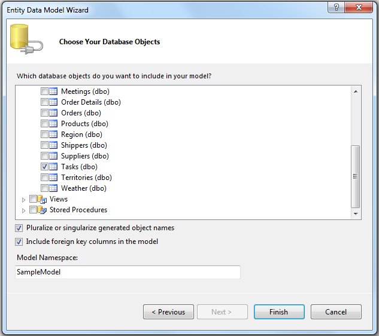
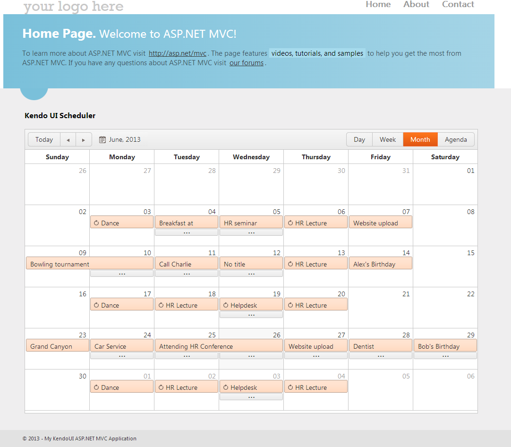

# Ajax Editing

## Getting started

The following tutorial shows how to configure Kendo UI Scheduler for ASP.NET MVC to do ajax editing of the Sample  database (the Tasks table) included in the offline demos.

1.  Create a new ASP.NET MVC 4 application (or Kendo UI ASP.NET MVC application if you have installed the [Kendo UI Visual Studio Extensions](/getting-started/using-kendo-with/aspnet-mvc/introduction#kendo-ui-for-asp.net-mvc-visual-studio-extensions)).
Name the application "KendoSchedulerAjaxEditing". If you decided not to use the Kendo UI Visual Studio Extensions follow the steps from the [introduction](/getting-started/using-kendo-with/aspnet-mvc/introduction) help topic in order
to add Kendo UI Complete for ASP.NET MVC to the application.
1.  Add a new "Entity Framework Data Model". Right click the `~/Models` folder in the solution explorer and pick "Add ->  New Item". Choose "Data -> ADO.NET Entity Data Model" in the "Add New Item" dialog.
Name the model "Sample.edmx" and click "Next". This will start the "Entity Data Model Wizard".

1.  Pick the "Generate from database" option and click "Next". Configure a connection to the Sample database. Click "Next".

1.  Choose the "Tasks" table from the "Which database objects do you want to include in your model?". Leave all other options as they are set by default. Click "Finish".

1. Add a new class to the `~/Models` folder. Name it `TaskViewModel`.

        public class TaskViewModel : ISchedulerEvent
        {
            public int TaskID { get; set; }
            public string Title { get; set; }
            public string Description { get; set; }

            private DateTime start;
            public DateTime Start
            {
                get
                {
                    return start;
                }
                set
                {
                    start = value.ToUniversalTime();
                }
            }

            private DateTime end;
            public DateTime End
            {
                get
                {
                    return end;
                }
                set
                {
                    end = value.ToUniversalTime();
                }
            }

            public string RecurrenceRule { get; set; }
            public int? RecurrenceID { get; set; }
            public string RecurrenceException { get; set; }
            public bool IsAllDay { get; set; }
            public int? OwnerID { get; set; }
        }

1.  Open HomeController.cs and add a new action method which will return the Tasks as JSON. The scheduler will make ajax requests to this action.

        public ActionResult Tasks_Read([DataSourceRequest]DataSourceRequest request)
        {
            using (var sampleDB = new SampleEntities())
            {

                IQueryable<TaskViewModel> tasks = sampleDB.Tasks.ToList().Select(task => new TaskViewModel() {
                    TaskID = task.TaskID,
                    Title = task.Title,
                    //Specify the DateTimeKind to be UTC
                    Start = DateTime.SpecifyKind(task.Start, DateTimeKind.Utc),
                    End = DateTime.SpecifyKind(task.End, DateTimeKind.Utc),
                    Description = task.Description,
                    IsAllDay = task.IsAllDay,
                    RecurrenceRule = task.RecurrenceRule,
                    RecurrenceException = task.RecurrenceException,
                    RecurrenceID = task.RecurrenceID,
                    OwnerID = task.OwnerID
                }).AsQueryable();

                return Json(tasks.ToDataSourceResult(request));
            }
        }
1.  Add new action method to HomeController.cs. It will be responsible for saving new data items. Name the method "Tasks_Create".

        public ActionResult Tasks_Create([DataSourceRequest]DataSourceRequest request, TaskViewModel task)
        {

            if (ModelState.IsValid)
            {
                using (var sampleDB = new SampleEntities())
                {
                    //Create a new Task entity and set its properties from the posted TaskViewModel
                    var entity = new Task
                    {
                        TaskID = task.TaskID,
                        Title = task.Title,
                        Start = task.Start,
                        End = task.End,
                        Description = task.Description,
                        RecurrenceRule = task.RecurrenceRule,
                        RecurrenceException = task.RecurrenceException,
                        RecurrenceID = task.RecurrenceID,
                        IsAllDay = task.IsAllDay,
                        OwnerID = task.OwnerID
                    };

                    // Add the entity
                    sampleDB.Tasks.AddObject(entity);
                    // Insert the entity in the database
                    sampleDB.SaveChanges();
                    // Get the TaskID generated by the database
                    task.TaskID = entity.TaskID;
                }
            }
            // Return the inserted task. The scheduler needs the generated TaskID. Also return any validation errors.
            return Json(new[] { task }.ToDataSourceResult(request, ModelState));
        }
1.  Add new action method to HomeController.cs. It will be responsible for saving updated data items. Name the method "Tasks_Update".

        public ActionResult Tasks_Update([DataSourceRequest]DataSourceRequest request, TaskViewModel task)
        {
            if (ModelState.IsValid)
            {
                using (var sampleDB = new SampleEntities())
                {
                    // Create a new Task entity and set its properties from the posted TaskViewModel
                    var entity = new Task
                    {
                        TaskID = task.TaskID,
                        Title = task.Title,
                        Start = task.Start,
                        End = task.End,
                        Description = task.Description,
                        RecurrenceRule = task.RecurrenceRule,
                        RecurrenceException = task.RecurrenceException,
                        RecurrenceID = task.RecurrenceID,
                        IsAllDay = task.IsAllDay,
                        OwnerID = task.OwnerID
                    };
                    // Attach the entity
                    sampleDB.Tasks.Attach(entity);
                    // Change its state to Modified so Entity Framework can update the existing task instead of creating a new one
                    //sampleDB.Entry(entity).State = EntityState.Modified;
                    // Or use ObjectStateManager if using a previous version of Entity Framework
                    sampleDB.ObjectStateManager.ChangeObjectState(entity, EntityState.Modified);
                    // Update the entity in the database
                    sampleDB.SaveChanges();
                }
            }
            // Return the updated task. Also return any validation errors.
            return Json(new[] { task }.ToDataSourceResult(request, ModelState));
        }

1.  Add new action method to HomeController.cs. It will be responsible for saving deleted data items. Name the method "Tasks_Destroy".

        public ActionResult Tasks_Destroy([DataSourceRequest]DataSourceRequest request, TaskViewModel task)
        {
            if (ModelState.IsValid)
            {
                using (var sampleDB = new SampleEntities())
                {
                    // Create a new Task entity and set its properties from the posted TaskViewModel
                    var entity = new Task
                    {
                        TaskID = task.TaskID,
                        Title = task.Title,
                        Start = task.Start,
                        End = task.End,
                        Description = task.Description,
                        RecurrenceRule = task.RecurrenceRule,
                        RecurrenceException = task.RecurrenceException,
                        RecurrenceID = task.RecurrenceID,
                        IsAllDay = task.IsAllDay,
                        OwnerID = task.OwnerID
                    };
                    // Attach the entity
                    sampleDB.Tasks.Attach(entity);
                    // Delete the entity
                    //sampleDB.Tasks.Remove(entity);
                    // Or use DeleteObject if using a previous versoin of Entity Framework
                    sampleDB.Tasks.DeleteObject(entity);
                    // Delete the entity in the database
                    sampleDB.SaveChanges();
                }
            }
            // Return the removed task. Also return any validation errors.
            return Json(new[] { task }.ToDataSourceResult(request, ModelState));
        }
1.  In the view configure the scheduler to use the action methods created in the previous steps.
    - Index.aspx (ASPX)

            <%= Html.Kendo().Scheduler<KendoSchedulerAjaxEditing.Models.TaskViewModel>()
                .Name("scheduler")
                .Date(new DateTime(2013, 6, 13))
                .StartTime(new DateTime(2013, 6, 13, 7, 00, 00))
                .Height(600)
                .Views(views =>
                {
                    views.DayView();
                    views.WeekView(weekView => weekView.Selected(true));
                    views.MonthView();
                    views.AgendaView();
                })
                .Timezone("Etc/UTC")
                .DataSource(d => d
                    .Model(m => {
                        m.Id(f => f.TaskID);
                        m.Field(f => f.OwnerID).DefaultValue(1);
                        //Set the recurrence ID field from the model:
                        m.RecurrenceId(f => f.RecurrenceID);
                    })
                    .Read("Tasks_Read", "Home")
                    .Create("Tasks_Create", "Home")
                    .Destroy("Tasks_Destroy", "Home")
                    .Update("Tasks_Update", "Home")
                )
            %>
    - Index.cshtml (Razor)

            @(Html.Kendo().Scheduler<KendoSchedulerAjaxEditing.Models.TaskViewModel>()
                .Name("scheduler")
                .Date(new DateTime(2013, 6, 13))
                .StartTime(new DateTime(2013, 6, 13, 7, 00, 00))
                .Height(600)
                .Views(views =>
                {
                    views.DayView();
                    views.WeekView(weekView => weekView.Selected(true));
                    views.MonthView();
                    views.AgendaView();
                })
                .Timezone("Etc/UTC")
                .DataSource(d => d
                    .Model(m => {
                        m.Id(f => f.TaskID);
                        m.Field(f => f.OwnerID).DefaultValue(1);
                        //Set the recurrence ID field from the model:
                        m.RecurrenceId(f => f.RecurrenceID);
                    })
                    .Read("Tasks_Read", "Home")
                    .Create("Tasks_Create", "Home")
                    .Destroy("Tasks_Destroy", "Home")
                    .Update("Tasks_Update", "Home")
                )
            )
1. Build and run the application

