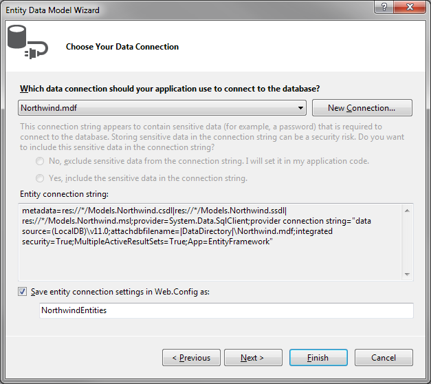
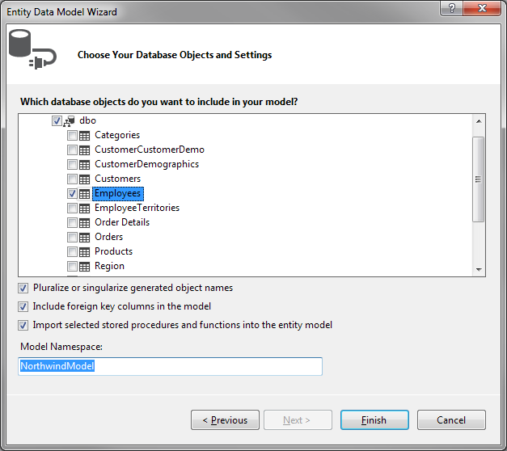

# Ajax Binding

## Getting Started

The following tutorial shows how to configure Kendo UI TreeView for ASP.NET MVC to do ajax binding using Entity Framework and the Northwind database.

1. Create a new ASP.NET MVC application (or Telerik UI for ASP.NET MVC application if you have installed the
[Telerik UI for ASP.NET MVC Visual Studio Extensions](/kendo-ui/getting-started/using-kendo-with/aspnet-mvc/introduction#kendo-ui-for-asp.net-mvc-visual-studio-extensions)).
1. Name the application **KendoTreeViewAjaxBinding**. If you decided not to use the Visual Studio extensions follow the procedure for adding Telerik UI for ASP.NET MVC to existing application:
[ASP.NET MVC 4](/kendo-ui/getting-started/using-kendo-with/aspnet-mvc/aspnet-mvc-4.md), [ASP.NET MVC 5](/kendo-ui/getting-started/using-kendo-with/aspnet-mvc/aspnet-mvc-5.md)
1. Add a new **Entity Framework DataM Model**. Right-click the **Models** folder in Visual Studio solution explorer and select **Add->New Item**. Choose **Data-> ADO.NET Data Model** from the **Add New Item** dialog.
1. Name the model **Northwind.edmx** and click **Next**. This starts the **Entity Data Model Wizard**.
1. Select **Generate from database** and click **Next**. Configure a connection to the Northwind database and click **Next**.

1. Select the **Employees** table and click **Finish**.

1. Open **Controllers/HomeController.cs** and add a new action method which will return JSON. The tree view will make an ajax request to this action method any time the
user expands a parent node. The action method returns only the child nodes of the expanded parent node. The tree view will provide the unique identifier of the parent node or `null` when it makes the initial request.

        public JsonResult Employees_Read(int? employeeId)
        {
            using (var norhtwind = new NorthwindEntities())
            {
                // Get employees who report to employeeId (null for root nodes)
                var employees = norhtwind.Employees
                                         // Workaround for the EF null comparison bug: http://stackoverflow.com/a/2541042/10141
                                         .Where(employee => employeeId.HasValue ? employee.ReportsTo == employeeId : employee.ReportsTo == null);
                // Project the results to avoid JSON serialization errors
                var result = employees.Select(employee => new
                                      {
                                          EmployeeID = employee.EmployeeID,
                                          Name = employee.FirstName + " " + employee.LastName,
                                          HasChildren = employee.Employees1.Any()
                                      })
                                      .ToList();
                return Json(result, JsonRequestBehavior.AllowGet);
            }
        }
1. Open **Views/Index.cshtml** (or **Views/Index.aspx**) and add a tree view.

    - Index.cshtml (Razor)

            @(Html.Kendo().TreeView()
                .Name("treeview")
                // The property that specifies the text of the node
                .DataTextField("Name")
                .DataSource(dataSource => dataSource
                    .Model(model => model
                        // The property that uniquely identieis a node.
                        // The value of this property is the argument of the action method
                        .Id("EmployeeID")
                        // the boolean property that tells whether a node has children
                        .HasChildren("HasChildren")
                    )
                    .Read(read => read
                        // The action method which will return JSON
                        .Action("Employees_Read", "Home")
                    )
                )
            )
    - Index.aspx (ASPX)

            <%: Html.Kendo().TreeView()
                .Name("treeview")
                // The property that specifies the text of the node
                .DataTextField("Name")
                .DataSource(dataSource => dataSource
                    .Model(model => model
                        // The property that uniquely identieis a node.
                        // The value of this property is the argument of the action method
                        .Id("EmployeeID")
                        // the boolean property that tells whether a node has children
                        .HasChildren("HasChildren")
                    )
                    .Read(read => read
                        // The action method which will return JSON
                        .Action("Employees_Read", "Home")
                    )
                )
            %>
1. Press **CTRL+F5** to build and run the application. Expand the **Andrew Fuller** node and the tree view will load its children.

