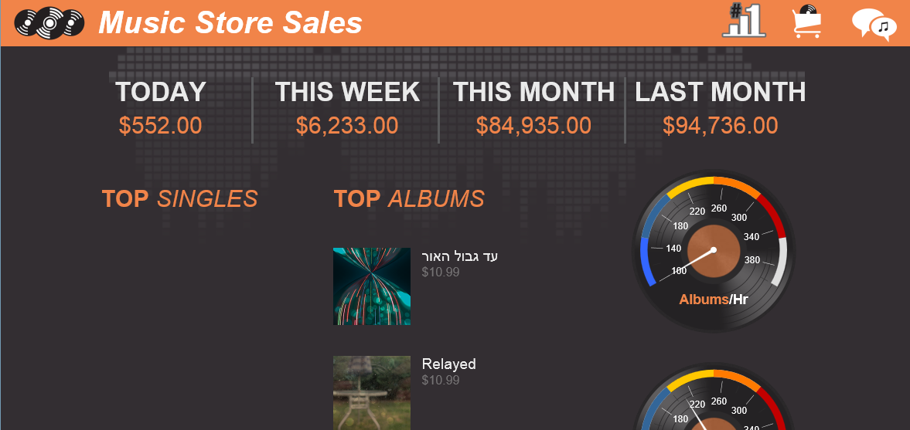

# Creating the Dashboard Main Page - Music Dashboard

The main page constitutes the landing page of the Dashboard, and the navigation strip, an overview of recent sales far various periods of time, top singles and albums, and a series of gauges showing hourly data. For this view, we use a declarative approach similar to the Kendo Music Store itself, also using the **data-** attributes, and the [Kendo MVVM](http://demos.kendoui.com/web/mvvm/index.html) framework.

This page is contained in the files **app/views/main.html**, **app/main-view.js**, and **Content/home-view.css**

## Displaying the Sales tabs
To implement the listings of Sales for the various times, we start with some simple HTML to define the categories to display:

	<section class="store-tall-tabs">
        
            
TODAY

            

        
        
            
THIS WEEK

            

        
        
            
THIS MONTH

            

        
        
            
LAST MONTH

            

        
    </section>

Each of the **amount** &lt;spans&gt;s contain the **data-bind** attribute that specifies the name of the data in the scheme to place in that view.

This data is bound to an external **DataSource**, which is pulled and bound to these display widgets in the **main-view.js** file:

	var totals = new kendo.data.DataSource({
        transport: {
            read: 'api/sales/totals'
        },
        schema : {
          data : function(response) {
              var item = {
                  today: kendo.toString(response.Today, "c"),
                  week: kendo.toString(response.Week, "c"),
                  month: kendo.toString(response.Month, "c"),
                  lastMonth: kendo.toString(response.LastMonth, "c")
              };
              return [item];
          }  
        },
        change: function (data) {
            console.log(data.items[0]);
            kendo.bind($("#home-view"), data.items[0]);
        }
    });
    totals.read();

Note that the value names in the scheme data of the DataSource match the **data-bind** tags of the views: **data-bind="text: lastMonth"** matches that tag to the **lastMonth** value pulled from the DataSource.

The entirety of the view information in **main.html** is wrapped in the following tag

	<section id="home-view">

so that the binding of the sales totals passes back through to the view. **kendo.bind($("#home-view"), data.items[0]); makes use of standard jQuery syntax and performs the binding.

## Displaying Top Singles and Albums List Views
These lists are created via a combination of HTML markup, templating, and MVVM binding, with the data provided by a remote DataSource. Starting with the markup:

	

        <h3 class="list-title">Top Singles</h3>
        

    

    

        <h3 class="list-title">Top Albums</h3>
        

	

Each requires a Kendo template, to render the invididual items in the proper manner. The **Single** template is below:

	

There are several differences in this approach to that used in the Kendo Music Store - the use of a remote DataSource facilitates some of the detail be moved around.

The bindings are invoked in the JavaScript (int **main-view.js**); this is also where the templates are applied and the DataSource is bound.

	var dataSource = new kendo.data.DataSource({
        transport: {
            read: {
                url: "api/top/tracks",
                dataType: "json"
            }
        }
    });

    $("#topSinglesListView").kendoListView({
        dataSource: dataSource,
        template: kendo.template($("#top-single-template").html()),
        dataBound: function (e) {
            // handle event
            $(".top-single-song-list-item").on("click", function (e) {
                e.preventDefault();
                window.location = "#/sales?target=singles";
            });
        }
    });

The **Albums** ListView is constructed similarly, with the same structure.

## Creating a Gauge with a custom background

The radial gauges on this page use a custom background image of a record. EVery gauge is contained within its own **&lt;div&gt;**, as shown below:

	

    	

        <header>
        	<h3 class="gauge-title">Albums/Hr</h3>
        </header>
	

The key here is the **class** attribute "**gauge-container** assigned to each.

Looking at the CSS for this page in **home-view.css**, the background image is defined in the **background-image** attribute:

	.gauge-container {
 		height: 250px;
  		display: inline-block;
 		margin: 0 40px;
 		background-image: url("../img/record-gauge-home.png");
 	  	background-repeat: no-repeat;
  	  	background-position-y: 15px;
  	  	width: 225px;
	}