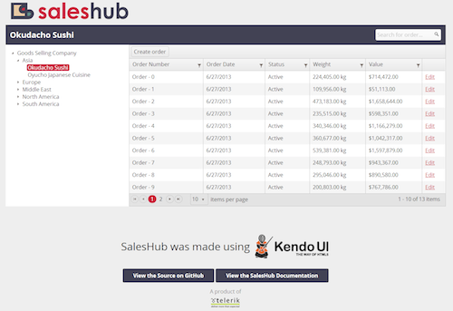
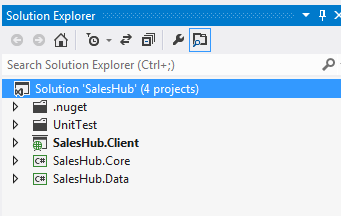

# Tutorial: SalesHub: Introduction

In this tutorial, we will review portions of the **SalesHub** sample project.

SalesHub is an Order Management System that demonstrates the usage of the Kendo UI MVC extensions in
an enterprise environment.

The goal of this sample project to is show how to use a subset of Kendo UI widgets using the Kendo UI MVC extensions, as well as
to show how to easily implement server-side filtering for [DataSource](/api/framework/datasource) requests, using the
server-side components that the Kendo UI MVC extensions provide.

This sample is not feature-complete and is only meant to be used as a reference for how to use the Kendo UI MVC extensions.

## View the live site

The live SalesHub demo can be viewed at [demos.kendoui.com/saleshub](http://demos.kendoui.com/saleshub).

# Getting Started

This sample project is for Microsoft Visual Studio 2012, and requires MVC4, NuGet, Kendo UI MVC extensions, and SQLExpress in order to run.

## Get the Source Code

Start by getting the source for [SalesHub from GitHub](https://github.com/telerik/kendo-saleshub-demo).

## Adding Kendo UI MVC Extensions to the Project

Due to licensing restrictions, the sample project does not include the dll for the Kendo UI MVC extensions.

If you have a license for the Kendo UI MVC extensions, you can use the [Telerik Control Panel](http://www.telerik.com/download-trial-file.aspx?pid=972)
to download and install the extensions. If you haven't purchased a license yet, you can download and install the 30 day [free trial](http://www.kendoui.com/download.aspx)
for the extensions.

Once you've downloaded and installed the extensions, all that is required is for `\wrappers\aspnetmvc\Binaries\Mvc3\Kendo.Mvc.dll` to be copied from the installation
directory of the Kendo UI MVC extensions into the `SalesHub\libs` directory.

> The standard installation directory for the extensions is **`c:\Program Files (x86)\Telerik\Kendo UI for ASP.NET MVC <version>`**.

## Building and Running the Application

Once you've copied **Kendo.Mvc.dll** to the correct location, you should be able to build and run the application.

The first time the application launches, it creates and seeds its database.

> Seeding the database may take a few minutes to complete.

# Solution Structure

There are three main projects in this sample application. They are:

1. **SalesHub.Client**:

	This is a standard MVC project and uses the default MVC project structure with one exception. The data services, which
	are MVC controllers that return JSON results, are in their own namespace (**SalesHub.Client.Api**), so as to avoid confusion
	with which controllers return Views and which ones return JSON.

2. **SalesHub.Data**:

	This project contains the Entity Framework repositories for data models.

3. **SalesHub.Core**:

	This project contains the data models and the repository interfaces used by SalesHub.Data.
